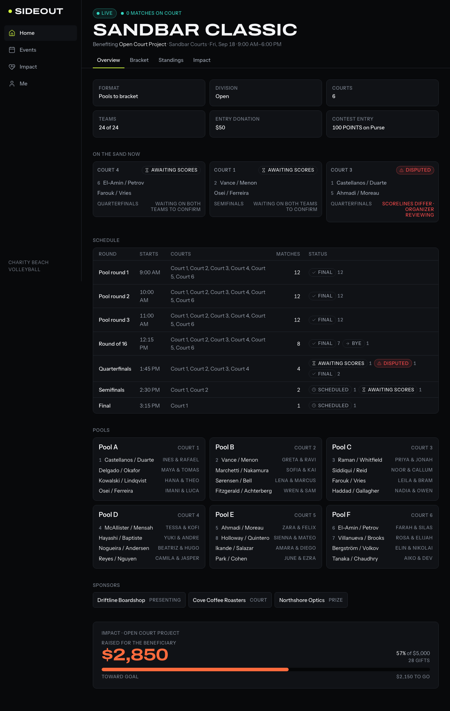
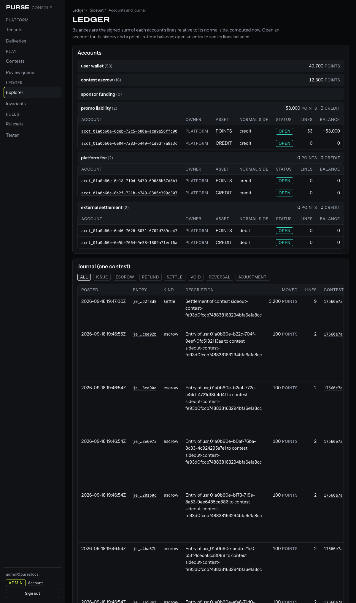
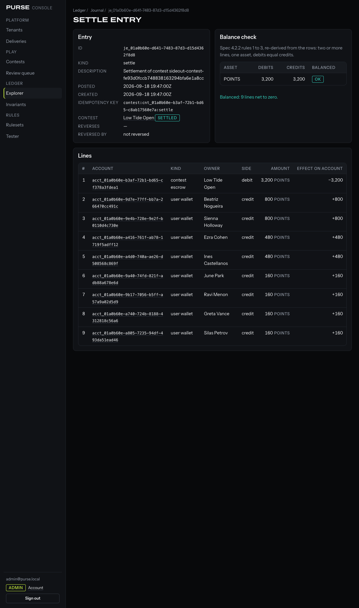

# Sideout on Purse

Sideout is a charity beach volleyball tournament app, and Purse is the competition
platform I built for it to run on: an immutable ledger, a contest and settlement engine,
versioned eligibility rules, an embeddable SDK, a webhook dispatcher and an operator
console, behind a boundary that Sideout can only cross over HTTPS.

The public demo runs on Railway and resets itself every night:

| | URL |
|---|---|
| Sideout | https://sideout-production-5898.up.railway.app |
| Purse API and embed | https://purse-production-b87b.up.railway.app (`/health`, `/embed/`, `/v1/*`) |
| Purse operator console | https://purse-console-production.up.railway.app |





The design is [`docs/system-spec.md`](docs/system-spec.md), which I treated as the
acceptance contract; every choice it left open, and every place I departed from it, is in
[`docs/decisions.md`](docs/decisions.md). How the demo is hosted is
[`docs/deploy.md`](docs/deploy.md).

## Quickstart

Node 22 (`.nvmrc`), pnpm 11, Docker for the Postgres.

```sh
git clone https://github.com/Mohith26/sideout-purse && cd sideout-purse
pnpm install
docker compose up -d           # Postgres 16: two databases, three roles, on first start
cp apps/purse/.env.example apps/purse/.env && cp apps/sideout/.env.example apps/sideout/.env
pnpm db:migrate                # both apps' migrations, each in its own process
pnpm db:seed                   # the tenant, its keys and ruleset, seven users, eight contests; nine tournaments
pnpm dev                       # Purse :4000, the embed :4100, the console :4200, Sideout :3000
```

Then http://localhost:3000 is Sideout, http://localhost:4200 is the console (sign in as
`admin@purse.local`; `pnpm --filter @purse/api db:seed -- --print-operator-password
--rotate-operator-password` prints a password), and `curl localhost:4000/health` is
Purse. `pnpm db:setup` provisions any other Postgres you can reach and writes the two
`.env` files for you. The seed prints nothing secret; `pnpm --filter @purse/api db:seed --
--print-keys` prints the sandbox keys the one time it creates them, and
`--print-keys --rotate-keys` reissues them. With `SIDEOUT_PURSE_SECRET_KEY` set and Purse
running, `pnpm db:seed` also walks the seeded tournaments into Purse (links, entries,
scores, the settled event closed), which is what the nightly reset does.

## What is where

```
apps/
  purse/           Purse API: Hono on Node 22, Drizzle + postgres, Zod. Owns the Purse database.
  purse-embed/     the iframe flows (sign-in, identity, wallet, entry, rewards): a static export the API serves under /embed
  purse-console/   the operator console: Next.js on its own origin, talks to the API's /console routes server-to-server
  sideout/         Sideout: Next.js App Router, Tailwind 4, a PWA. Owns the Sideout database.
packages/
  purse-sdk/       @purse/sdk     the partner client: mounts the iframe, runs the handshake, verifies webhooks
  purse-types/     @purse/types   error taxonomy, resource shapes, the eligibility vocabulary, the iframe protocol
  ui/              @sideout/ui    design tokens, Tailwind theme, the dense primitives
  ids/ db/ logger/ config/        @repo/*: typed-prefix ids, connection and migration helpers, JSON logs, lint and tsconfig presets
docker/            the compose Postgres init, and the demo-reset job image
docs/              system-spec.md, decisions.md, providers.md, deploy.md, screenshots/
test/              repository-level tests: the boundary rule, env isolation, the Dockerfiles' shape
```

Checks: `pnpm typecheck && pnpm lint && pnpm test && pnpm build`. CI runs those against a
Postgres service, then migrates, seeds and reconciles a Purse database (a failing
invariant fails the build), runs the console's Playwright smoke, and starts the API to run
Sideout's integration walk and the two end-to-end flows against it.

## The architecture, and the four rules

```
┌──────────────────────────────────────────────────────────────────────┐
│ sideout-production-5898.up.railway.app         Sideout (Next.js)     │
│  ┌────────────────────────────────────────────────────────────────┐  │
│  │ events, pools, bracket, score entry, standings, impact         │  │
│  │  ┌──────────────────────────────────────────────────────────┐  │  │
│  │  │ <iframe src="purse-production-b87b.up.railway.app/embed">│  │  │
│  │  │  sign-in, identity, wallet, entry confirm, rewards       │  │  │
│  │  │  typed postMessage, exact origin, nonce-checked           │  │  │
│  │  └──────────────────────────────────────────────────────────┘  │  │
│  └────────────────────────────────────────────────────────────────┘  │
│  Sideout server: tournaments, teams, the score consensus             │
│  Sideout DB (Postgres)                     ← Purse has no access     │
└──────────────┬───────────────────────────────────────────────────────┘
               │ HTTPS, secret key, server to server, Idempotency-Key on every write
               │ webhooks back, HMAC-signed
┌──────────────▼───────────────────────────────────────────────────────┐
│ purse-production-b87b.up.railway.app           Purse (Hono / Node)   │
│  /v1 API · contest engine · ledger · settlement · eligibility        │
│  /embed (the iframe app) · webhook dispatcher · /console API         │
│  Purse DB (Postgres)                       ← Sideout has no access   │
└──────────────────────────────────────────────────────────────────────┘
┌──────────────────────────────────────────────────────────────────────┐
│ purse-console-production.up.railway.app   the operator console       │
│  (its own origin and sessions; no database; calls /console/* above)  │
└──────────────────────────────────────────────────────────────────────┘
```

1. **Separate databases.** Two logical databases on one Postgres, two connection strings
   that are never loaded into the same process (`test/env-isolation.test.ts` proves each
   app's `loadEnv` ignores the other's), no foreign key across the line. Sideout holds
   Purse ids as opaque strings and nothing Purse-shaped otherwise: no column of Sideout's
   holds a `POINTS` amount, and a schema test keeps it that way.
2. **The secret key never reaches a browser.** `sk_` keys are used server to server; the
   `pk_` publishable key only bootstraps the iframe. Sideout's build greps its client
   bundle for `sk_` and fails; so does the console's for `sk_`, `whsec_` and session
   tokens. The one component that imports `@purse/sdk` is `PurseGate`, and a lint rule
   plus a test hold it there.
3. **Sideout owns the outcome, Purse owns the settlement.** Sideout decides what the
   score is with its own consensus rules and pushes the result; Purse decides what it
   pays, and refuses to settle a contest that a human has not closed behind a frozen
   preview.
4. **Every Purse mutation is idempotent.** Every write takes an `Idempotency-Key`. A
   replay returns the stored response with `Idempotent-Replayed: true` and creates
   nothing; the same key with a different body is a `conflict`. Sideout's `confirmed`
   state is literally a replay: the proof that Purse durably holds a score is that
   sending it again changes nothing.

The monorepo makes the boundary a lint rule rather than a physical fact (decision D1):
Sideout may import from Purse only `@purse/sdk` and `@purse/types`, Purse imports nothing
from Sideout, the embed and console apps import none of the API's source. `packages/config/eslint/boundary.js`
enforces it and `test/boundary.test.ts` proves the rule fires.

## How a score becomes a payout

**The consensus** (spec 5.2, `apps/sideout/src/domain/consensus.ts`, pure). Both teams
submit a scoreline independently. A submission is canonicalised (sets in order, sides
normalised) and hashed; agreement is equality of hashes, never a comparison of who said
what.

```
awaiting_first
  └─ one team submits ─────────────────► awaiting_second
        ├─ the other submits the same hash ──► agreed
        └─ the other submits a different hash ► disputed
disputed ──── organizer resolves ──────────► agreed
agreed ────── Purse accepts the scores ────► pushed_to_purse
pushed_to_purse ── Purse's replay confirms ► confirmed
```

Only `agreed` may push to Purse, and only under the idempotency key minted on entering
`agreed`. Submissions are append-only rows, superseded and never edited. The match goes
`final` inside the same transaction as `agreed`, and the winner is advanced in the
bracket; a `disputed` match blocks the tournament's close until an organizer picks a
reading. What Purse receives is not the set scores: each player's team's match wins so far
as a running score after every agreed match, and once every match is final, one finished
score per player derived from the final standings (a strictly better placement is a
strictly higher score; the two players of a team share one), so Purse's ranking reproduces
Sideout's standings exactly.

**The contest** (spec 4.3, `apps/purse/src/contests/`). The tournament is mirrored as a
contest in `POINTS` with a 100-point stake per player; linking a Purse account grants
1,000 welcome points once. The contest moves through one `transition()` function that
takes `SELECT ... FOR UPDATE` on its row, checks the move against a table the database
also enforces in a trigger, and writes the audit log:

```
draft → open → locked → in_progress → awaiting_settlement → settling → settled
                  └────────── voided (every stake refunded) ──────┘        cancelled (held nothing)
```

Registration opening creates and opens it; each player confirms their own entry in the
iframe, which escrows the stake; going live locks and starts it; the final scores move it
to `awaiting_settlement` by itself. Then the organizer fetches the preview, which the
settlement engine computes and hashes, and closes with that hash. The close recomputes
under the row lock; if anything changed since the preview the hashes differ and nothing
moves. Twenty-five simultaneous closes produce exactly one settlement
(`apps/purse/test/contests/concurrency.test.ts`).

**The entry.** This is the real settlement of the seeded Low Tide Open (16 teams, so 32
players and 3,200 points in escrow; no sponsor prizes, so the default 50 / 30 / 20 split,
which each team's two players share, and the two semifinal losers tie for third), as the
console shows it:



```
je_01a0b60e-d641-7483-87d3-d15d4362f8d8   settle   idempotency key contest:cnt_…17560e7a:settle

  #  account (kind, owner)                         side     amount
  1  acct_…b3af  contest_escrow  Low Tide Open     debit    3,200 POINTS
  2  acct_…9d7e  user_wallet     Beatriz Nogueira  credit     800 POINTS   1st
  3  acct_…9e4b  user_wallet     Sienna Holloway   credit     800 POINTS   1st
  4  acct_…a416  user_wallet     Ezra Cohen        credit     480 POINTS   2nd
  5  acct_…a4d0  user_wallet     Ines Castellanos  credit     480 POINTS   2nd
  6  acct_…9a40  user_wallet     June Park         credit     160 POINTS   =3rd
  7  acct_…9b17  user_wallet     Ravi Menon        credit     160 POINTS   =3rd
  8  acct_…a740  user_wallet     Greta Vance       credit     160 POINTS   =3rd
  9  acct_…a805  user_wallet     Silas Petrov      credit     160 POINTS   =3rd
                                                   3,200 = 3,200   balanced
```

Before it, each of the 32 entries was its own two-line entry (`debit user_wallet 100 /
credit contest_escrow 100`), and each welcome grant a two-line `issue` (`debit
promo_liability 1,000 / credit user_wallet 1,000`), which is why the explorer above shows
promo liability at −53,000 against 40,700 in wallets and 12,300 in escrow. One
`contest_results` row per entrant (placement, score, payout, the entry that paid it) is
written once, in the same transaction, and the `contest.settled` webhook tells Sideout,
whose profile screen reads the wallet back live rather than storing it.

## How the ledger cannot drift

The ledger (`apps/purse/src/ledger/`) is an immutable double-entry journal. Every entry
has at least two lines, in one asset, and debits equal credits; balances are derived by
summing lines, so the balance at any past instant is one `WHERE posted_at <= $1` away.
`postEntry` checks the rules before it writes, and a deferred constraint trigger checks
them again at commit, so a writer that bypasses the service is held to the same rules.
Wallets and escrows may not go negative; sorted `FOR UPDATE` locks make that hold under
concurrency.

Nothing is ever updated or deleted, and that is a fact about the database role, not a
convention: the API runs as `purse_app`, which holds `SELECT` and `INSERT` on the journal
and nothing else. A test issues the `UPDATE` and expects Postgres to refuse it; the API
refuses to boot on a role that could. Corrections are reversing entries. The migrator
role that owns the tables never runs in the API process (the container entrypoint drops
its connection string before the server starts).

`reconcile()` checks the seven invariants of spec 4.2.4 and records every run:

| | Invariant |
|---|---|
| I1 | the journal nets to zero per asset |
| I2 | every entry balances |
| I3 | no user wallet is negative |
| I4 | settled and voided contests have zero escrow |
| I5 | a settled contest's payouts equal what it escrowed |
| I6 | every balance snapshot equals its derived balance |
| I7 | every contest entry links to a matching escrow entry |

It runs every 15 minutes on the demo, in CI against the seeded database, and from the
console's invariant panel; Purse's `/health` reports the newest run and answers 503 while
it failed, which is what pages.

The test I would read first is `apps/purse/test/ledger/random-ops.test.ts`: ten thousand
seeded random operations (issue, escrow, refund, settle, void, replay, reversal, attempted
overdraft, and every contest operation: create, open, lock, start, enter, withdraw, score,
close behind the preview hash, void, cancel), many fired concurrently, checked against an
independent replay of every accepted line, and then `reconcile()` must come back clean.
`LEDGER_RANDOM_OPS=500 LEDGER_RANDOM_SEED=1` runs a short one; CI refuses fewer than the
full ten thousand.

## The rounding rule

Every share is computed with floor division in `bigint`. Whatever the floors leave over is
handed out one minor unit at a time to the best placement first, then the next, and within
a tie group by ascending user id. Nothing is lost and nothing is invented. 100 points
split three ways is **34 / 33 / 33**, never 33 / 33 / 33 with a unit missing; `[50, 30,
20]` of 101 points is **51 / 30 / 20**.

The settlement engine (`apps/purse/src/settlement/`) is a pure function: no database,
clock or randomness, and the same input gives the same output byte for byte whatever order
the entrants arrive in. Conservation (`sum(payout) === escrowTotal`, exactly),
non-negativity, placement monotonicity and determinism under permutation are `fast-check`
properties over thousands of generated contests (`apps/purse/test/settlement/settle.test.ts`),
not examples. The prize structures and the tie rules are in
[`apps/purse/src/settlement/README.md`](apps/purse/src/settlement/README.md).

## The provider seams

Where something cannot be built honestly I built the seam and named the vendor. Licensing
and real KYC are deliberately out of scope: this is an architecture exercise, not a
licensed operator, and nothing here is legal tender.

| Seam | Interface | Dev implementation | Stands in for |
|---|---|---|---|
| Identity | `IdentityProvider.verify(user) → { outcome: verified \| rejected \| pending, providerRef }`, called from `POST /v1/users/:id/verification` between two short transactions, never under a lock | deny-listed external ids are `rejected`, pending-listed stay `pending`, allow-listed are `verified`; anyone else is `verified` with a name and a date of birth and `rejected` without. The reference is a digest, never anything about the person. | **Persona** or **Socure**: a hosted inquiry in the iframe, finished by webhook. The table has no column that could hold a document. |
| Geolocation | `GeoProvider.resolve({ declaredRegion?, ip? }) → { region, confidence, source }`, on user upsert and on every entry that carries a location | a declared region at face value (0.6); otherwise a lookup of RFC 5737 / 6598 documentation prefixes (`203.0.113.x → US-TX`, ...) at 0.9; anything else resolves to no region, which the evaluator reports as `region_unknown` | **GeoComply**: a device-side fix with a licensed geofence and a spoofing verdict |
| Risk | `RiskProvider.assess(transaction) → { decision: allow \| review \| deny, signals[] }`, alongside the pure evaluator at entry, with the journal's velocity and the user's open flags | the spec's velocity and duplicate-account rules as signals; any signal answers `review`, which becomes an operator flag and lets the entry through; it never answers `deny` | **Sardine**: device, behaviour and payment signals scored in real time |

Each is selected by `IDENTITY_PROVIDER` / `GEO_PROVIDER` / `RISK_PROVIDER`; only `dev`
exists, and a production process refuses to start on it unless `ALLOW_DEV_PROVIDERS=true`
is set on purpose, as it is on the demo. The eligibility rules themselves are real: a
versioned JSON ruleset evaluated by a pure function, with the ruleset version stored on
every decision, and the seeded version is the spec's own example (`POINTS` free to enter
anywhere, `CREDIT` region-gated, verification-gated and stake-limited).
[`docs/providers.md`](docs/providers.md) has the full table and what crosses each seam.

## What is not built, and why

- **No real money.** The contest currency is closed-loop: `POINTS` for free entry and
  `CREDIT` for sponsor-funded prizes redeemable for goods. No cash prizes, no withdrawal,
  no peer-to-peer wagering. The ledger, the escrow model and the settlement math are the
  same as a real-money system's; swapping the asset for legal tender is a licensing
  problem, not an architecture problem.
- **Donations are real and separate.** The charity dollars go through Stripe and never
  enter the contest ledger: a donation row is not a journal line, a sponsor's prize
  contribution shapes the split but never sits in escrow, and the public responses are
  built from a hand-listed shape that omits every `purse_*` field. (The demo has no
  Stripe account yet, so it takes free registrations only.)
- **No real identity, geolocation or risk vendor**, per the table above; and no SMS
  provider is chosen, so the demo's phone sign-in answers 503 and the end-to-end flows
  mint their sessions with the deployment's own secret.
- **One replica of everything**: the rate limiter and the webhook dispatcher are
  in-process. Custom domains, double elimination, signed device attestations, SSE, and the
  rest of spec section 12 are listed as follow-ups in `docs/decisions.md`.

## Where I departed from the spec's defaults

Every section 3 default was taken (`docs/decisions.md` has the table) with these
exceptions and additions:

- **D12 and section 10: Railway's own domains, no custom DNS.** The spec defaults to
  `sideout.<yourdomain>` and friends; the demo uses `*.up.railway.app` for now. Every
  origin is a variable, so a custom domain is a DNS change and a variable change. One
  consequence: `up.railway.app` is on the public suffix list, so Sideout and Purse are
  different *sites*, which is the cross-site case the embed session cookie was built for
  and the deployed flows exercise.
- **D11: polling stayed.** The default was polling for v1 and SSE in polish; every live
  screen still polls at 5 s, and SSE is a follow-up.
- **D2, plus one thing the spec did not ask for.** Two logical databases as specified,
  but Purse connects as two roles: `purse_migrator` owns the tables and runs migrations,
  seeds and the demo reset; `purse_app`, the runtime, owns nothing and cannot rewrite
  the journal. The append-only guarantee is Postgres's, not mine.
- **Cron as jobs, not timers.** The reconcile and the nightly reset are Railway cron
  services rather than timers in the API, so a restart does not reset the schedule and
  the reset's owner-role credentials never sit in the API process.
- **A failing invariant is a 503.** "Pages you" is implemented as the status code of
  Purse's `/health`, so any uptime check on the code alone pages, and Railway will not
  switch a deploy onto a ledger that does not reconcile.
- **One spec value changed.** `--text-tertiary` is `#7D8591`, not the spec's `#646C79`,
  which failed AA on every surface; the contrast test in `@sideout/ui` would fail on the
  original.
