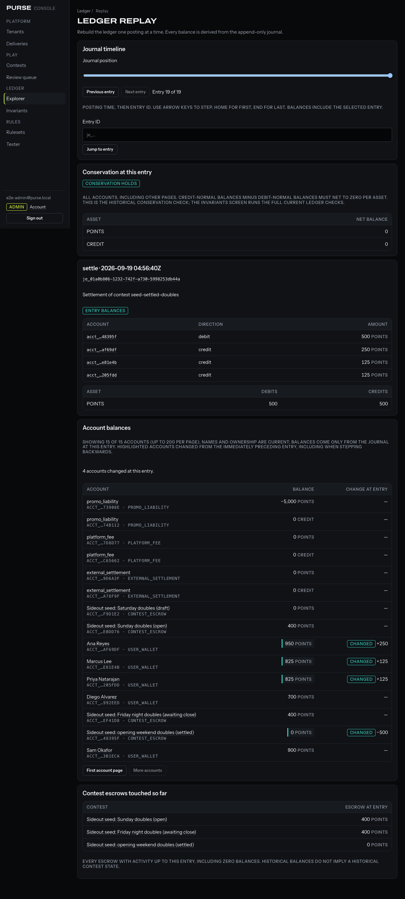

# Point-in-time ledger replay

In the operator console, open **Ledger → a tenant → Replay**. The latest entry opens
first. Drag the slider, use Previous/Next, or focus the slider and use arrow keys,
Home and End. The screen announces the loaded position. Jump to a full `je_…` entry
ID to inspect a particular posting.

Each view contains the selected entry and its debit/credit lines, every account's
balance (200 accounts per page), the change caused by that entry, conservation totals
for each asset, and every contest escrow with activity up to that position. A Changed
badge accompanies the balance highlight; it does not rely on colour alone. Changes
always compare the selected entry with its immediate predecessor in the journal,
regardless of the direction or distance moved in the UI.

The address becomes `/tenants/<tenant>/ledger/replay?at=<entry-id>`. Copy it to another
operator; authentication is still required. Account pages add `after=<account-id>`.
Back/forward restores the position. A failed request retains the last successful view
and reports an error; stale responses cannot overwrite a newer slider choice.

## Read contract

`GET /console/tenants/:tenantId/ledger/replay` uses the existing operator session.
Optional query parameters:

- `at`: a journal entry ID belonging to this tenant.
- `position`: a one-based journal position, for the slider; mutually exclusive with `at`.
- `after`: the last account ID of the previous account page.

No position means the latest entry. An empty journal returns position/total zero, a
null entry and zero balances. A missing or foreign entry receives the same
`entry_not_found` refusal. Invalid query parameters receive `validation_failed`.

The response contract is `LedgerReplayResource` in `@purse/types`. `accountCount`,
`accountLimit` and `nextAccountCursor` explicitly describe pagination. Conservation,
changed account IDs, entry lines and the escrow list cover the whole position even
when an account page omits a changed wallet. Money is returned as decimal strings;
SQL sums are cast to text and decoded with `BigInt`, never JavaScript numbers.

`apps/purse/src/ledger/replay.ts` computes the entire response with one SQL statement
and one PostgreSQL MVCC snapshot. It ranks the tenant's entries by `(posted_at, id)`,
aggregates their lines through the selected entry, and joins that aggregate to accounts.
There is no balance query per account and no persisted balance cache. Cost scales with
the tenant's journal history and account count; the response caps account pages at 200.
Selected entry lines and touched escrows are complete, so a large settlement or tenant
with many contests can still produce a large response.

The ordering matches the existing explorer and keeps full database timestamp precision.
An entry-ID cursor distinguishes entries with identical posting timestamps. The existing
`balanceOf(asOf: Date)` includes all entries at its time cutoff instead; timestamp ties
therefore intentionally differ from an entry cutoff. All currently visible committed
entries participate; this is posting-order replay, not a reconstruction of transaction
commit order or a permanently frozen database snapshot.

Account names and ownership describe current metadata; accounts with no lines yet have
zero historical balance. Contest state is deliberately not reconstructed from today's
state. Historical conservation means credit-normal balances minus debit-normal balances
net to zero for each asset. Entry debit/credit equality is shown separately. The full
seven current invariants remain on the **Invariants** screen.

## Verification

`apps/purse/test/console/replay.test.ts` covers position arithmetic, first/middle/last
balances against `balanceOf`, changed accounts, tenant boundaries, empty journals,
pagination, timestamp ties, reversals and amounts above JavaScript's safe integer limit.
Console component tests cover failed navigation and stale-response races.

Run `pnpm typecheck && pnpm lint && pnpm test && pnpm build`, then
`pnpm --filter @purse/console e2e`. The console smoke moves the native slider with the
keyboard, verifies changed balances and green checks, follows back navigation, jumps by
ID and reloads the deep link. It writes the screenshot above. The build also checks that
no secret or session token reaches the browser bundle. No new service, schema migration,
or environment variable is required.
