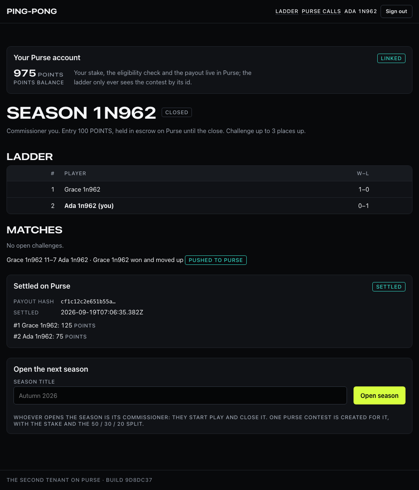

# The second tenant: an office ping-pong ladder on Purse

Stretch item 4 of the system spec (section 12): "stand up a throwaway second product on
the same Purse instance in an afternoon. Nothing proves a platform is a platform like a
second consumer." This is that product, `apps/pingpong` (`@pingpong/web`), and what
building it proved and exposed is in `docs/decisions.md` ("Stretch: second tenant
decisions").

## What it is

An office table-tennis ladder. Players sign in with their name and a shared office code
(that is the whole of its authentication; it is an office). A season is opened by whoever
opens it, the commissioner. Players enter the season; the ladder ranks them in entry order.
Once the commissioner starts play, a player may challenge anyone up to three places above
them, one open challenge at a time. A match is one game to 11, won by two; either player
reports the scoreline and the other confirms it (or rejects it, back to challenged). A
confirmed win by the challenger moves them into the defender's place and everyone between
down one; a defender's win moves nobody. The commissioner closes the season in two steps.

Each season is one Purse contest, and every piece of value lives there:

| Ladder | Purse |
|---|---|
| a player | a user, upserted by an opaque external id (`POST /v1/users`); the welcome grant of 1,000 POINTS issued once under a fixed key |
| open a season | `POST /v1/contests` (kind `pool`, 100 POINTS a head, `percentage_split` 50/30/20), then `open` |
| enter the season | the SDK's `entry` flow in Purse's own iframe, on Purse's origin: the eligibility check and the escrow happen there; the ladder then reads the entrants back (`GET /contests/:id/preview`) and seats the new ones at the bottom |
| start play | `lock`, then `start` |
| a confirmed result | both players' running scores (wins so far, `attemptFinished: false`) in one `POST /contests/:id/scores` under the key minted at confirmation |
| close, step 1 | every entrant's final score (rank upside down, `attemptFinished: true`; Purse moves to `awaiting_settlement`), then the preview, frozen on the season with its `payoutHash`; nothing is played from then on |
| close, step 2 | `POST /contests/:id/close` with that exact hash; Purse recomputes and refuses any other; the settlement is kept verbatim |

Every request to Purse is recorded in the ladder's own `purse_calls` table before it leaves
and completed when it returns, bodies redacted of anything key-shaped, exactly as Sideout's
is; `/audit` shows it. The secret key lives in the server's `PurseClient` and nowhere else:
`scripts/check-bundle.ts` fails the build if `sk_` or the variable's name reaches the
browser bundle.

## Where things are

- `src/domain/ladder.ts`: the rules, pure (`judgeChallenge`, `judgeScoreline`, `applyResult`,
  the scores the ladder tells Purse); `test/domain/ladder.test.ts` is the case table.
- `src/server/`: `players.ts` (sign-in), `seasons.ts`, `matches.ts` (every write under the
  season's row lock), `purse/` (`users.ts` link and embed tokens, `contests.ts` the mirror
  and the entrant read-back, `scores.ts` the pushes, `close.ts` the two-step close).
- `src/purse/`: the typed client, its schemas, errors, redaction and the call recorder: a
  copy of Sideout's with the methods the ladder does not need left out.
- `src/app/`: `/` (sign in), `/ladder` (everything, one screen), `/audit`, `/health`, and
  the API under `/api`. `src/components/PurseFrame.tsx` is the one component that imports
  `@purse/sdk`; the boundary lint refuses it anywhere else.
- `src/db/schema.ts`: `players`, `seasons`, `season_entries` (the ladder), `ladder_matches`,
  `purse_calls`. Its own Postgres database, `pingpong`, its own role `pingpong_app`
  (`pnpm db:setup` and the compose init create both), its own migrations.

## Running it

`pnpm dev` starts it on :3100 with the other apps. Its environment (`src/env.ts` is the
list): `PINGPONG_DATABASE_URL` (and `_TEST`), `SESSION_SECRET` and `OFFICE_CODE`
(defaults outside production: `table-tennis`), `PURSE_API_URL`,
`PINGPONG_PURSE_SECRET_KEY` (the `seed:pingpong:secret:sandbox` key `pnpm --filter
@purse/api db:seed -- --print-keys` prints the one time it is created),
`NEXT_PUBLIC_PURSE_PUBLISHABLE_KEY`, `NEXT_PUBLIC_PURSE_ORIGIN` and
`NEXT_PUBLIC_PURSE_TENANT_ID` (`tnt_01a0c2f0-5e7a-7b4e-9d1a-4f2b8c6d0e11` is the seeded
tenant, the default outside production). Without a secret key the Purse routes answer 503
`purse_unavailable` and the rest of the app works. The Purse seed allowlists
`http://localhost:3100` for the tenant; a deployed origin goes in `PURSE_PINGPONG_ORIGINS`
(the tenant's own variable, next to Sideout's `PURSE_TENANT_ORIGINS`).

`pnpm --filter @pingpong/web db:migrate`, `db:seed` (four players; linked to Purse when a
key is configured), `demo:reset` (`DEMO_RESET=allow`; empties the ladder and reseeds).

Tests: `pnpm --filter @pingpong/web test` runs the domain tests and the route tests against
the in-memory Purse (`test/purse/fake-purse.ts`), and the integration walk
(`test/integration/purse-walk.test.ts`) when `PURSE_INTEGRATION_API_URL` and
`PINGPONG_INTEGRATION_SECRET_KEY` name a real Purse. `pnpm --filter @pingpong/web e2e` is the
Playwright smoke (`e2e/smoke.spec.ts`: two players, one confirmed result, the ladder
reorders, the season closes and the payouts land) against the built app on :3110 and a
Purse API on :4030; it needs `PINGPONG_PURSE_SECRET_KEY` and the tenant's publishable key
(`PINGPONG_PURSE_PUBLISHABLE_KEY`, or `NEXT_PUBLIC_PURSE_PUBLISHABLE_KEY`), a built embed
(`pnpm --filter @purse/embed build`), and it resets the ladder's database first. Against a
deployment: `BASE_URL=https://... E2E_PURSE_URL=https://... OFFICE_CODE=... pnpm --filter
@pingpong/web e2e`, with no season open on the board. CI runs all of it
(`.github/workflows/ci.yml`).

## Deploying it

The fourth service follows `docs/deploy.md`'s per-service pattern: `apps/pingpong/Dockerfile`
(multi-stage, non-root, health-checked, built from the repository root;
`test/docker.test.ts` pins it), `docker-entrypoint.sh` migrates first and fails the deploy
on an error, `GET /health` reports the sha, the migration state, the SDK version and what
Purse's `/health` says. Variables: `NODE_ENV=production`, `PORT=3100`,
`PINGPONG_DATABASE_URL` (`DATABASE_ADMIN_URL=... pnpm db:setup --no-write-env
--no-test-databases --pingpong-password ...` provisions the `pingpong` database and role next
to the others; the admin URL through the environment, because pnpm echoes a script's
arguments), `SESSION_SECRET`,
`OFFICE_CODE`, `TRUSTED_PROXY_HOPS=1`, `PURSE_API_URL`, `PINGPONG_PURSE_SECRET_KEY`, the
three `NEXT_PUBLIC_PURSE_*`, `BUILD_SHA`, `RAILWAY_DOCKERFILE_PATH=apps/pingpong/Dockerfile`;
on the `purse` service, `PURSE_PINGPONG_ORIGINS=https://<pingpong domain>` so the seed and
the nightly reset allowlist it. No secret is written anywhere but the host's variables.

### Deployed

**Live URL:** https://pingpong-production-bc24.up.railway.app, the `pingpong` service of the
Railway project in `docs/deploy.md`, deployed 2026-09-19 at commit `9d8dc37`. Sign in with
any name and the office code, which is the service's `OFFICE_CODE` variable (a shared
secret for the office, kept where the other secrets are). How it went up, in order:

1. The five existing services were redeployed at the same commit first (`docs/deploy.md`,
   "To redeploy"), so the `purse` and `demo-reset` images carry `seedSecondTenant` before
   the nightly reset runs: a reset from the previous image would have deleted the second
   tenant's platform accounts without recreating them.
2. `railway add --service pingpong` with `NODE_ENV`, `PORT` and `RAILWAY_DOCKERFILE_PATH`;
   `railway domain --service pingpong --port 3100`; then `PURSE_PINGPONG_ORIGINS=<that
   domain>` on `purse`, referenced from `demo-reset` (`${{purse.PURSE_PINGPONG_ORIGINS}}`).
3. The `pingpong` database and role through the Postgres proxy (`db:setup`, above), the
   Purse seed through the same proxy with both origins variables set (`--print-keys` printed
   the tenant's pair the one time it was created), and the variables listed above on the
   service, secrets through `railway variable set <NAME> --stdin`. The health check path
   (`/health`, 180 s) and restart policy (`ON_FAILURE`, 10) were set through
   `serviceInstanceUpdate`, the same as the other web services.
4. `railway up --service pingpong --detach`; `/health` answered 200 with the sha,
   `migrations.pending: 0` and `purse.reachable: true`.

Verified on the live origin with the smoke (`BASE_URL=... E2E_PURSE_URL=... OFFICE_CODE=...
pnpm --filter @pingpong/web e2e`): two players signed in and linked, entered the season in
Purse's frame on the deployed Purse, the commissioner started play, the challenger won 11–7,
both confirmed, the ladder reordered, the result was pushed, the frozen preview showed
125/75 of the 200-point escrow, the close settled and the wallets read 1025 and 975; a
`GET /internal/reconcile` on the deployed Purse straight after found every invariant holding
with the second tenant's settlements in the ledger.

*The screenshot is from that run against the live origin: the season closed, the challenger
first, the 50/30 split of the 200-point escrow paid out, the commissioner's wallet re-read.*

## What it does not do

- No webhooks: the ladder reads Purse back when it needs to (entrants after the entry
  flow, the settlement at the close) and never waits on a delivery. A receiver would be a
  copy of Sideout's.
- No identity flow, no CREDIT, no location: POINTS contests need none of it under the
  seeded ruleset, and an office does not want to verify anyone.
- The nightly demo reset on Purse deletes every tenant's users and contests; the ladder's
  own `demo:reset` runs separately, so after a Purse reset a player links again (the app
  offers it) and a season whose contest is gone is closed by opening the next one. A reset
  per tenant is one of the things the second consumer exposed (`docs/decisions.md`).
